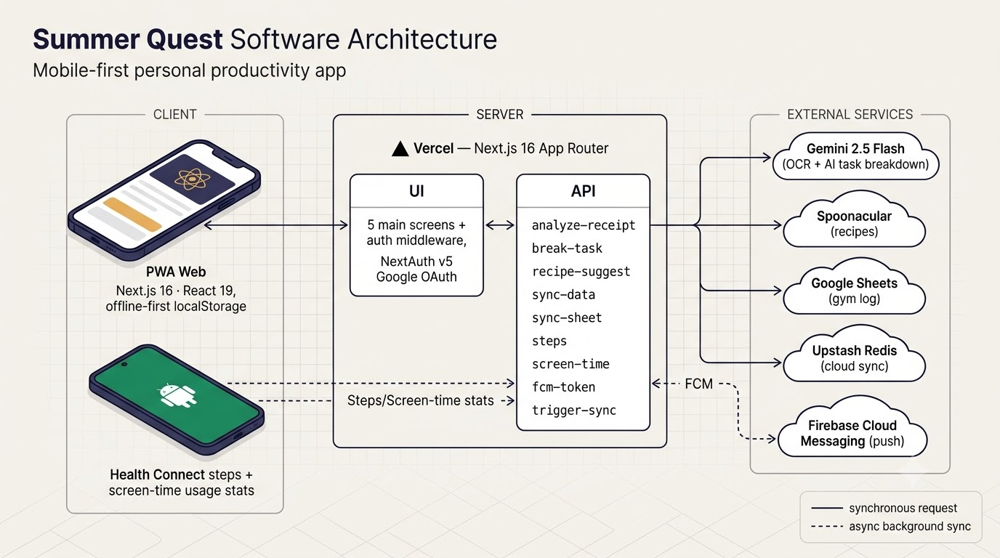

# Summer Quest 🏆

Personal all-in-one productivity app that gamifies daily habits, finances, nutrition, gym training and health metrics into a single mobile-first dashboard.

Built with **Next.js 16 · React 19 · TypeScript · Tailwind 4**. Offline-first (localStorage) with cloud sync (Upstash Redis) and an Android companion for health data.

---

## Architecture



**Data flow:** Solid arrows are synchronous requests; dashed arrows are asynchronous background sync (health data + push triggers). The web app works offline (localStorage) and reconciles with Upstash Redis on foreground.

---

## Screens

| Tab | Description |
|-----|-------------|
| 🏠 **Hoy** | Daily non-negotiable habits (6 areas), progress ring, steps, screen time, Pomodoro timer · **Ayuda 2 min** (AI breaks a blocking task into mini-steps) |
| 🍽️ **Food** | 5 meals/day with macros for training vs rest days · Spoonacular recipe ideas + saved recipes |
| 💰 **Finanzas** | Receipt OCR (Gemini), manual entry, 27 categories, auto-categorization (supermarket · café · horchata), income tracking, day/week/month views + 50/30/20 insights · **monthly report export** (Markdown for NotebookLM / PDF) |
| 🏋️ **Gym** | A/B/C workout rotation, weight×reps tracking, progression analytics, **week/month stats** (workout types + time trained), Google Sheets sync |
| 📊 **Stats** | Habit completion %, streaks, per-area breakdowns, **navigable steps explorer** (month/year totals, average, best day + bar chart) |

Secondary tabs: **Carrera** (career habits) and **Quests** (non-daily habits by area).

---

## Tech Stack

| Layer | Technology |
|-------|------------|
| Framework | Next.js 16 (App Router) · React 19 · TypeScript |
| Styling | Tailwind CSS 4 · shadcn/ui · Lucide icons |
| Auth | NextAuth v5 (beta) · Google OAuth + email whitelist |
| Storage | localStorage (offline) + Upstash Redis (merge-by-ID cloud sync) |
| AI / APIs | Gemini 2.5 Flash (OCR + Zod) · Spoonacular (recipes) · Google Sheets (gym) |
| Push | Firebase Cloud Messaging → Android companion |
| Companion | Android (Kotlin) — Health Connect steps + UsageStatsManager screen time |
| Deploy | Vercel (auto-deploy from `main`) |

---

## API Routes

| Route | Method | Purpose | Auth |
|-------|--------|---------|------|
| `/api/analyze-receipt` | POST | Receipt OCR → expense items (Gemini) | Session |
| `/api/break-task` | POST | Break a task into mini-steps (Gemini) | Session |
| `/api/recipe-suggest` | POST | Recipes by macro constraints (Spoonacular) | Bypass |
| `/api/sync-data` | GET/POST | Cloud backup/restore of localStorage (Redis) | Session |
| `/api/sync-sheet` | GET/POST | Write gym workouts to Google Sheets | Session |
| `/api/steps` · `/api/screen-time` | GET/POST | Health data from Android | Bearer |
| `/api/fcm-token` | GET/POST | Store Firebase push token | Bearer |
| `/api/trigger-sync` | POST | Silent FCM push to wake Android | Bypass |

**Sync model:** upload debounced (300 ms) + `sendBeacon` on page hide; download on mount/foreground. Array keys (`sq_expenses`, `sq_gym_logs`) merge by `id`; other keys restore only when local is empty.

---

## Environment Variables

```env
# Auth
AUTH_SECRET=
AUTH_GOOGLE_ID=
AUTH_GOOGLE_SECRET=
ALLOWED_EMAILS=                      # comma-separated whitelist

# AI / APIs
GOOGLE_GENERATIVE_AI_API_KEY=
SPOONACULAR_API_KEY=

# Cloud storage
UPSTASH_REDIS_REST_URL=
UPSTASH_REDIS_REST_TOKEN=

# Android sync
STEPS_API_TOKEN=
FIREBASE_SERVICE_ACCOUNT_JSON=       # single-line JSON

# Gym sync
GOOGLE_SHEETS_CLIENT_EMAIL=
GOOGLE_SHEETS_PRIVATE_KEY=
```

---

## Local Development

```bash
npm install
npm run dev          # http://localhost:3000
```

---

## Roadmap

Actively expanding towards a full life-tracker.

### Recently shipped

- **Ayuda 2 min** — AI breaks a blocking task into a 2-minute first action + mini-step checklist
- **Finanzas monthly report** — export a month as Markdown (for NotebookLM) / PDF
- **Gym week/month stats** — workout types + time trained (with session-duration tracking)
- **Steps explorer** — navigable month/year totals, average, best day + bar chart
- **New finance categories** — café, horchata, psicólogo, entrenador, Urban Sports, lentillas, uni, cine, libros + keyword auto-categorization

### Next up (near-term)

- **CSV import** — bulk-backfill past months of expenses/income from a bank export
- **Gym weight tracker** — manual log + chart (Renpho mock → Google Health later)
- **Study tracker** — AI master's degree progress screen
- **Books tracker** — reading log + "20 pages/day" habit (manual first, Goodreads later)
- **Payroll tracker** — nómina screen + payslip PDF OCR
- **Admin Life** — to-do + cleaning schedule that feeds the calendar; voice notes → shopping list

### Planned (larger / AI-heavy)

- **Home redesign** — day-type routines (energía / calma / productividad / admin) with morning + evening flows, stored in Redis, per-routine stats
- **Gym workout OCR diary** — photograph a workout → structured log
- **Cycle calendar** — menstrual phases + training/nutrition insights
- **Running tracker** — sessions + AI insights
- **Gym AI coach** — load progression, cycle-aware
- **Food photo OCR** — meal photo → macros & quantities
- **Voice recorder** — transcript → categorized notes + shopping list
- **Health tracker + RAG** — weight, food, cycle, workouts, steps, medical records → weekly health report
- **Wishlist** — voice + photos, price estimation and **price tracking** of wanted products
- **Jefe Final** — weekly boss challenge aggregating steps / finance / deep-work; reward = a small wishlist item
- **Auto NotebookLM sync** — end-of-month report pushed to a Google Doc source (no public NotebookLM upload API yet)

This is a private project — not for redistribution.
