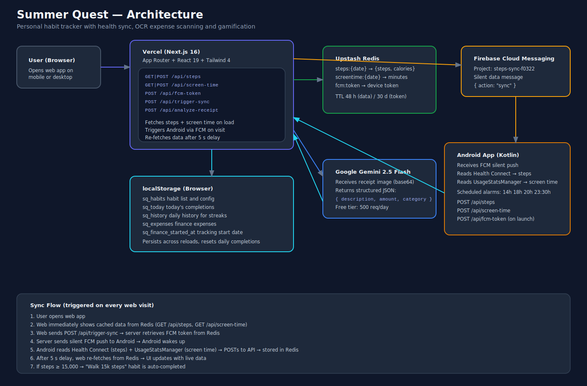

# Summer Quest

Personal productivity app that turns daily habits, finances and health metrics into a gamified quest.

## Architecture



## Features

| Screen | Description |
|--------|-------------|
| **Today** | Daily non-negotiable habits, steps, screen time and Pomodoro timer |
| **Quests** | Weekly/scheduled habits filtered by day (e.g. Tue/Thu/Sat) |
| **Finance** | OCR receipt scanner (Gemini), monthly total, streak of days under 10 EUR |
| **Career** | Career-focused habits and goals |
| **Stats** | Streak, best streak, weekly chart and progress by area |

## Tech Stack

- **Framework**: Next.js 16 (App Router) + React 19
- **Styling**: Tailwind CSS 4 + shadcn/ui
- **Deployment**: Vercel
- **Database**: Upstash Redis (steps, screen time, FCM token)
- **Push notifications**: Firebase Cloud Messaging (silent sync trigger)
- **AI**: Google Gemini 2.5 Flash (receipt OCR, free tier)
- **Local persistence**: localStorage (habits, streaks, expenses)
- **Mobile companion**: Android app (Kotlin) syncing Health Connect + UsageStatsManager

## Setup

```bash
npm install
npm run dev
```

## Environment Variables (Vercel)

Set these in **Vercel → Project → Settings → Environment Variables**:

```env
GOOGLE_GENERATIVE_AI_API_KEY=       # Google AI Studio key (free)
UPSTASH_REDIS_REST_URL=             # Upstash console
UPSTASH_REDIS_REST_TOKEN=           # Upstash console
STEPS_API_TOKEN=                    # Secret token for Android → API auth
FIREBASE_SERVICE_ACCOUNT_JSON=      # Firebase service account JSON (single line)
```

## How Sync Works

1. User opens web → shows cached data from Redis
2. Web calls `POST /api/trigger-sync` → server sends silent FCM push
3. Android wakes up → reads Health Connect (steps) + UsageStatsManager (screen time)
4. Android POSTs fresh data to `/api/steps` and `/api/screen-time`
5. Web re-fetches after 5 s → UI updates with live data
6. If steps ≥ 15,000 → "Walk 15k steps" habit auto-completes
