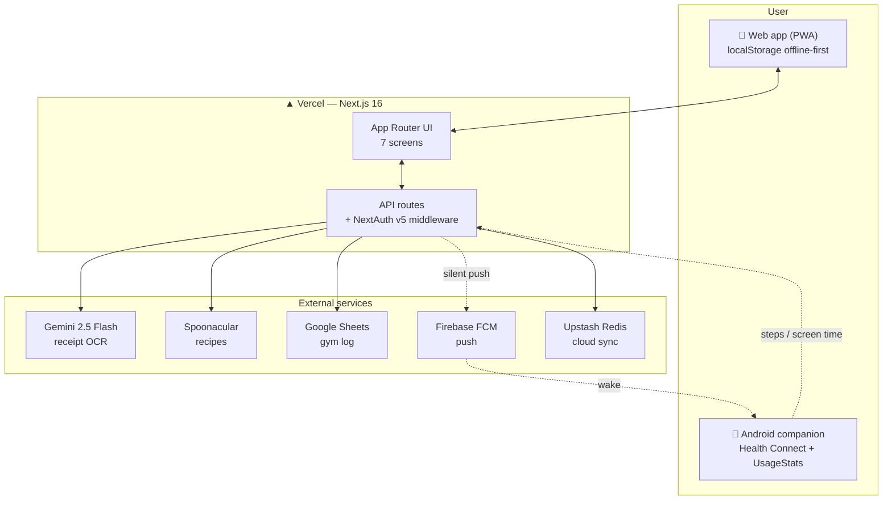

# Summer Quest 🏆

Personal all-in-one productivity app that gamifies daily habits, finances, nutrition, gym training and health metrics into a single mobile-first dashboard.

Built with **Next.js 16 · React 19 · TypeScript · Tailwind 4**. Offline-first (localStorage) with cloud sync (Upstash Redis) and an Android companion for health data.

---

## Architecture



**Data flow:** Solid arrows are synchronous requests; dashed arrows are asynchronous background sync (health data + push triggers). The web app works offline and reconciles with Redis on foreground.

---

## Screens

| Tab | Description |
|-----|-------------|
| 🏠 **Hoy** | Daily non-negotiable habits (6 areas), progress ring, steps, screen time, Pomodoro timer |
| 🍽️ **Food** | 5 meals/day with macros for training vs rest days · Spoonacular recipe ideas + saved recipes |
| 💰 **Finanzas** | Receipt OCR (Gemini), manual entry, 21 categories, auto-categorization (supermarket & café), income tracking, day/week/month views + 50/30/20 insights |
| 🏋️ **Gym** | A/B/C workout rotation, weight×reps tracking, progression analytics, Google Sheets sync |
| 📊 **Stats** | Habit completion %, streaks, steps, weekly charts, per-area breakdowns |

Secondary tabs: **Carrera** (career habits) and **Quests** (non-daily habits by area).

---

## Tech Stack

| Layer | Technology |
|-------|------------|
| Framework | Next.js 16 (App Router) · React 19 · TypeScript |
| Styling | Tailwind CSS 4 · shadcn/ui · Lucide icons |
| Auth | NextAuth v5 (beta) · Google OAuth + email whitelist |
| Storage | localStorage (offline) + Upstash Redis (merge-by-ID cloud sync) |
| AI / APIs | Gemini 2.5 Flash (OCR + Zod) · Spoonacular (recipes) · Google Sheets (gym) |
| Push | Firebase Cloud Messaging → Android companion |
| Companion | Android (Kotlin) — Health Connect steps + UsageStatsManager screen time |
| Deploy | Vercel (auto-deploy from `main`) |

---

## API Routes

| Route | Method | Purpose | Auth |
|-------|--------|---------|------|
| `/api/analyze-receipt` | POST | Receipt OCR → expense items (Gemini) | Session |
| `/api/recipe-suggest` | POST | Recipes by macro constraints (Spoonacular) | Bypass |
| `/api/sync-data` | GET/POST | Cloud backup/restore of localStorage (Redis) | Session |
| `/api/sync-sheet` | GET/POST | Write gym workouts to Google Sheets | Session |
| `/api/steps` · `/api/screen-time` | GET/POST | Health data from Android | Bearer |
| `/api/fcm-token` | GET/POST | Store Firebase push token | Bearer |
| `/api/trigger-sync` | POST | Silent FCM push to wake Android | Bypass |

**Sync model:** upload debounced (300 ms) + `sendBeacon` on page hide; download on mount/foreground. Array keys (`sq_expenses`, `sq_gym_logs`) merge by `id`; other keys restore only when local is empty.

---

## Environment Variables

```env
# Auth
AUTH_SECRET=
AUTH_GOOGLE_ID=
AUTH_GOOGLE_SECRET=
ALLOWED_EMAILS=                      # comma-separated whitelist

# AI / APIs
GOOGLE_GENERATIVE_AI_API_KEY=
SPOONACULAR_API_KEY=

# Cloud storage
UPSTASH_REDIS_REST_URL=
UPSTASH_REDIS_REST_TOKEN=

# Android sync
STEPS_API_TOKEN=
FIREBASE_SERVICE_ACCOUNT_JSON=       # single-line JSON

# Gym sync
GOOGLE_SHEETS_CLIENT_EMAIL=
GOOGLE_SHEETS_PRIVATE_KEY=
```

---

## Local Development

```bash
npm install
npm run dev          # http://localhost:3000
```

---

## Roadmap

Actively expanding towards a full life-tracker. Highlights in progress:

- **Finanzas** — clearer fixed vs variable split, payroll tracker (PDF), sharper AI insights
- **Gym** — weight tracking, running tracker, workout OCR diary, AI coach, weekly/monthly stats
- **Health** — cycle calendar with training insights, food photo OCR, books & study trackers
- **Home** — day-type routines (energía/calma/productividad/admin) replacing the flat habit list
- **Admin Life** — to-do + cleaning schedule, voice notes → shopping list

This is a private project — not for redistribution.
